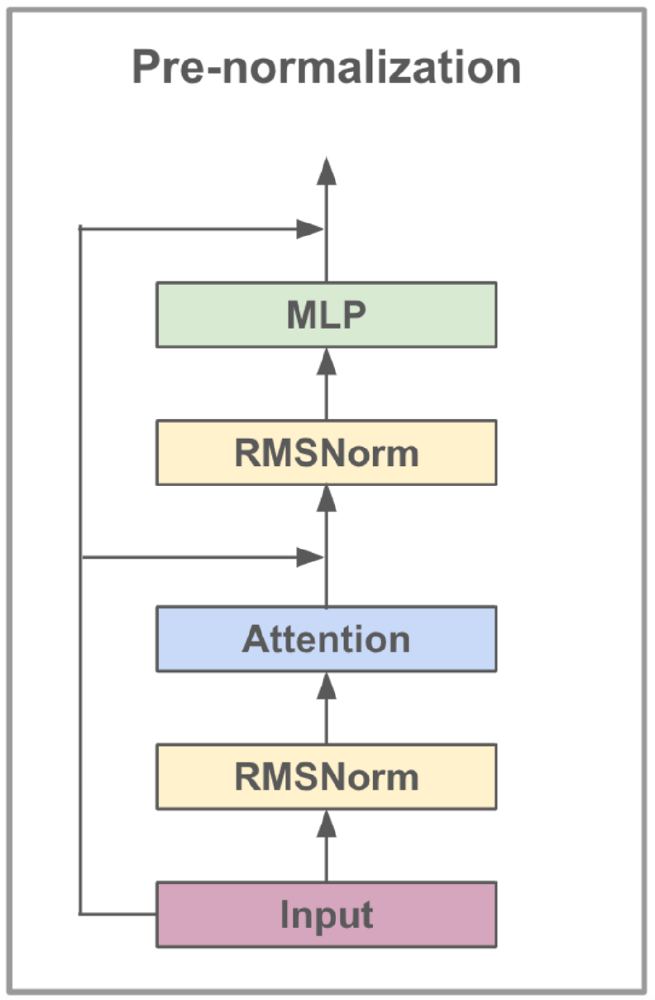
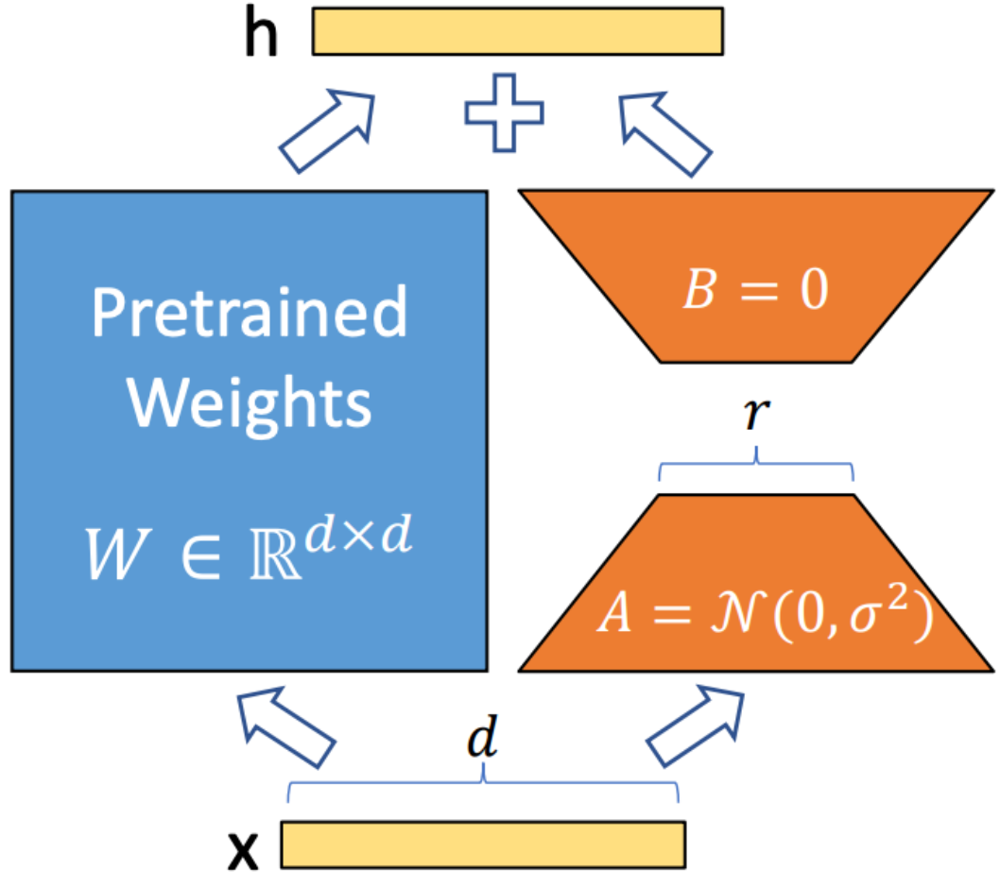
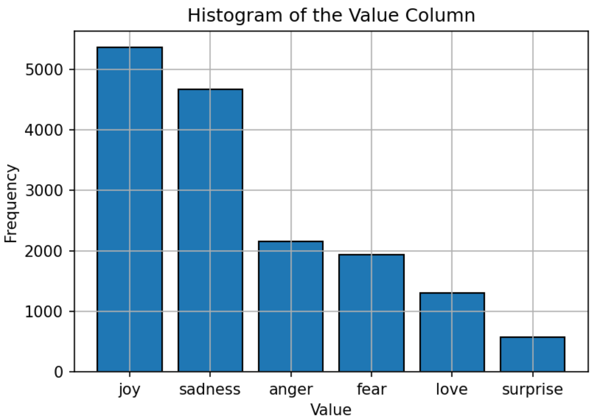

# 基于 Llama3-8B 与 LoRA 的情感文本分类

## 项目介绍

本项目基于 Llama3-8B 大语言模型，结合 LoRA（Low-Rank Adaptation） 和 FlashAttention 技术，实现情感文本分类任务。模型用于识别六类情绪：

·喜悦（joy）
·悲伤（sadness）
·愤怒（anger）
·恐惧（fear）
·爱（love）
·惊讶（surprise）

实验结果表明，该方法在该任务上取得 0.9262 的准确率，优于 Bert-Base、Bert-Large、Roberta-Base、Roberta-Large 等主流模型。

## 特性

- **模型**: Llama3-8B（通过监督学习进行微调）
- **训练方式**: LoRA（高效参数微调）
- **优化技术**: FlashAttention（提升注意力计算效率）
- **数据集**: 六分类情感文本数据集
- **性能**: 准确率达到 0.9262，优于多个NLP模型

## 方法

    
     
    <b>Figure 1: Architecture of Llama3-8b</b>

### 模型结构（Llama3-8B）

Llama3-8B 是 Meta 开发的大语言模型，具有约 80 亿参数，针对对话任务进行了优化。

其训练流程包括：

1️⃣ 预训练（Pretraining）
2️⃣ 指令微调（SFT）
3️⃣ 基于人类反馈的强化学习（RLHF）

该流程使模型在“有用性”和“安全性”方面更接近人类偏好。

### 架构优化（GQA）

Llama3 引入了 Grouped-Query Attention（GQA）：

· 多个 Query 共享 Key-Value
· 降低显存占用
· 提升计算效率

项目	参数
参数规模	8B
上下文长度	8K
训练数据	公共数据
Token 数量	15T+
知识截止时间	2023年3月
GQA	支持

    <table>
        <caption><b>Table 1: Llama3-8b Model Details</b></caption>
        <tr>
            <th>Feature</th>
            <th>Specification</th>
        </tr>
        <tr>
            <td>Training Data</td>
            <td>Publicly available data</td>
        </tr>
        <tr>
            <td>Parameters</td>
            <td>8B</td>
        </tr>
        <tr>
            <td>Context Length</td>
            <td>8k</td>
        </tr>
        <tr>
            <td>GQA</td>
            <td>Yes</td>
        </tr>
        <tr>
            <td>Token Count</td>
            <td>15T+</td>
        </tr>
        <tr>
            <td>Knowledge Cutoff</td>
            <td>March 2023</td>
        </tr>
    </table>

### 指令微调（Instruction Fine-Tuning）

指令微调通过专门构建的指令数据集，使模型具备更强的：
· 零样本能力（zero-shot）
· 指令理解能力
例如类似 Alpaca 数据集，可以让模型表现接近 GPT 系列。

### LoRA 微调方法

LoRA（Low-Rank Adaptation）通过在 Transformer 层中引入低秩矩阵来实现参数高效微调。

其特点：
· 不修改原始模型参数
· 仅训练少量低秩参数
· 显著降低显存和计算成本
· 推理阶段无额外开销

    
     
    <b>Figure 2: LoRA Training Method</b>

### Flash Attention V2

FlashAttention V2 用于优化 Transformer 中的注意力计算：

· 分块计算（减少内存访问）
· 提高 cache 利用率
· 支持流水线并行
· 利用稀疏性减少计算量
结果：显著提升训练和推理效率

## 实验

    
     
    <b>Figure 3: Emotion Text Label Distribution</b>

### Data Analysis

The dataset used for training the model consists of text labeled with six emotions: joy, sadness, anger, fear, love, and surprise. The distribution of the dataset is relatively balanced, with "Joy" being the most common emotion and "Surprise" the least. This balanced distribution provides a strong foundation for the model to accurately classify emotions without bias towards any particular category.

### Experiment Settings

The Llama3-8b model's hyperparameters are set as follows:

    <table>
        <caption><b>Table 2: Experiment Settings for Llama3-8b</b></caption>
        <tr>
            <th>Parameter</th>
            <th>Setting</th>
        </tr>
        <tr>
            <td>Optimizer</td>
            <td>Adam</td>
        </tr>
        <tr>
            <td>Learning Rate</td>
            <td>5e-5</td>
        </tr>
        <tr>
            <td>Batch Size</td>
            <td>5</td>
        </tr>
        <tr>
            <td>Epochs</td>
            <td>3</td>
        </tr>
        <tr>
            <td>LoRA Rank</td>
            <td>8</td>
        </tr>
        <tr>
            <td>Gradient Accumulation Steps</td>
            <td>4</td>
        </tr>
        <tr>
            <td>Max Length</td>
            <td>512</td>
        </tr>
    </table>

The model is trained using the Adam optimizer, known for its adaptive learning rate capabilities. A cosine learning rate schedule is employed to adjust the learning rate during training. The batch size is set to 5, with gradient accumulation over 4 steps to optimize memory usage. The model is trained for 3 epochs, with the FP16 precision format used to save GPU memory while maintaining performance. The LoRA rank of 8 indicates the order of the low-rank matrix used in the adaptation process.

### Evaluation Metrics

The primary metric used to evaluate the model's performance is accuracy. This metric measures the proportion of correct predictions made by the model out of all predictions. The formula for accuracy is:

$$
\text{Accuracy} = \frac{\text{TP} + \text{FN}}{\text{TP} + \text{FP} + \text{FN} + \text{TN}}
$$

Where:
- TP = True Positive
- FP = False Positive
- FN = False Negative
- TN = True Negative

### Experiment Analysis

The model's performance is compared against other popular NLP models, such as Bert-Base, Bert-Large, Roberta-Base, and Roberta-Large. The Llama3-8b model achieves the highest accuracy of 0.9262, demonstrating the effectiveness of instruction fine-tuning and the model's large parameter set. The superior performance of Llama3-8b in this task underscores the advantages of large language models in achieving high accuracy across diverse and challenging text classification tasks.

    <table>
        <caption><b>Table 3: Accuracy Results for Different Models</b></caption>
        <tr>
            <th>Model</th>
            <th>Accuracy</th>
        </tr>
        <tr>
            <td>Bert-Base</td>
            <td>0.9063</td>
        </tr>
        <tr>
            <td>Bert-Large</td>
            <td>0.9086</td>
        </tr>
        <tr>
            <td>Roberta-Base</td>
            <td>0.9125</td>
        </tr>
        <tr>
            <td>Roberta-Large</td>
            <td>0.9189</td>
        </tr>
        <tr>
            <td>Llama3-8b</td>
            <td>0.9262</td>
        </tr>
    </table>

## Conclusion

This project demonstrates the potential of large language models, such as Llama3-8b, in domain-specific tasks like emotion text classification. The model's performance, boosted by specialized techniques like LoRA and FlashAttention, underscores the effectiveness of large models in achieving high accuracy in NLP applications.

## License

This project is licensed under the Apache License 2.0 - see the [LICENSE](LICENSE) file for details.

This project is based on modifications to the original work available under [LLaMA-Factory](https://github.com/hiyouga/LLaMA-Factory), which is licensed under the Apache License 2.0.

## Contact

For any questions or issues, please contact Daoyuan Li at lidaoyuan2816@gmail.com.
